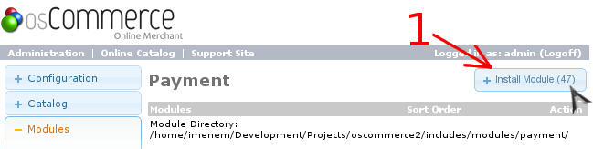
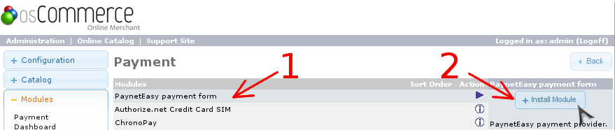
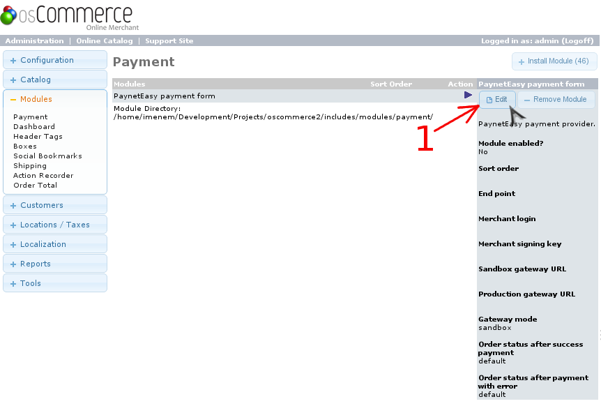
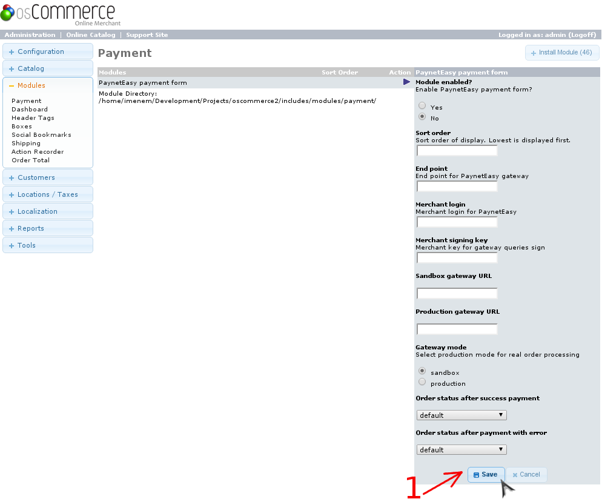

# Настройка плагина

1. Перейдите в панель администрирования OsCommerce
2. Перейдите в раздел управления платежными модулями
    1. Выберите в левом меню раздел "Modules" (стрелка #1)
    2. Выберите в открывшемся списке пункт "Payment" (стрелка #2)

    
2. Перейдите в раздел установки модулей (стрелка #1)

    
3. Установите модуль PaynetEasy
    1. Выберите модуль в списке, нажав на него (стрелка #1)
    2. Нажмите "Install Module" (стрелка #2)

    
4. Перейдите в режим редактирования настроек модуля (стрелка #1)

    
5. Настройте модуль
    1. Заполните форму
    2. Сохраните настройки (стрелка #1)

    
