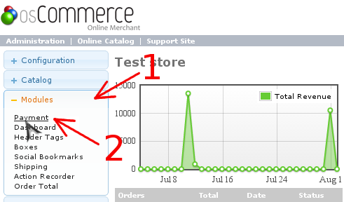
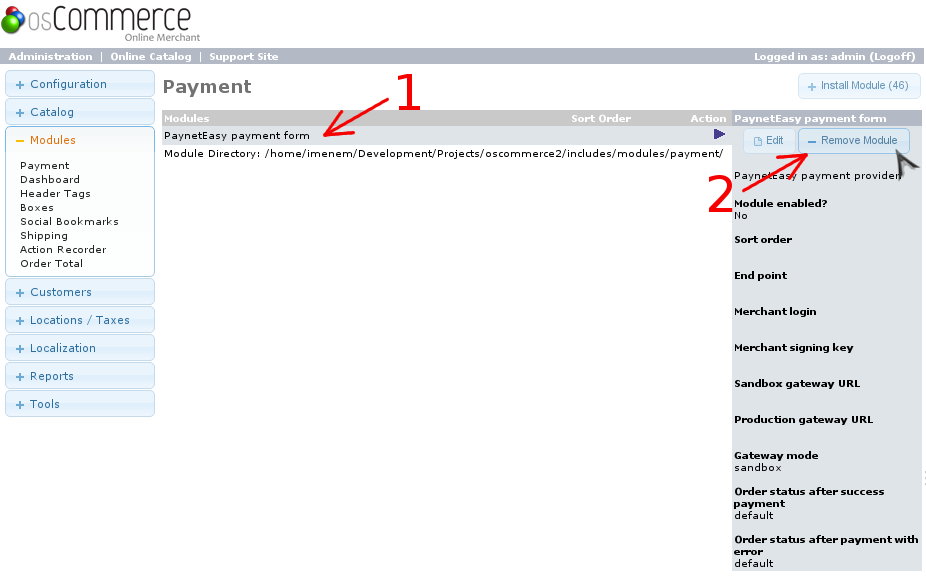

# Удаление плагина

## Удаление модуля в панели администрирования

1. Перейдите в панель администрирования OsCommerce
2. Перейдите в раздел управления платежными модулями
    1. Выберите в левом меню раздел "Modules" (стрелка #1)
    2. Выберите в открывшемся списке пункт "Payment" (стрелка #2)

    
3. Удалите модуль
    1. Выберите модуль в списке, нажав на него (стрелка #1)
    2. Нажмите "Remove Module" (стрелка #2)

    

## Удаление файлов плагина

Для полного удаления плагина необходимо удалить некоторые папки и файлы. Пути к ним даны относительно корневой папки OsCommerce. Список файлов и папок для удаления:

* `ext/modules/payment/payneteasyform/sale_finisher.php`
* `includes/languages/english/modules/payment/payneteasyform.php`
* `includes/modules/payment/payneteasyform/`
* `includes/modules/payment/payneteasyform.php`
* `vendor/composer/`
* `vendor/payneteasy/`
* `vendor/autoload.php`